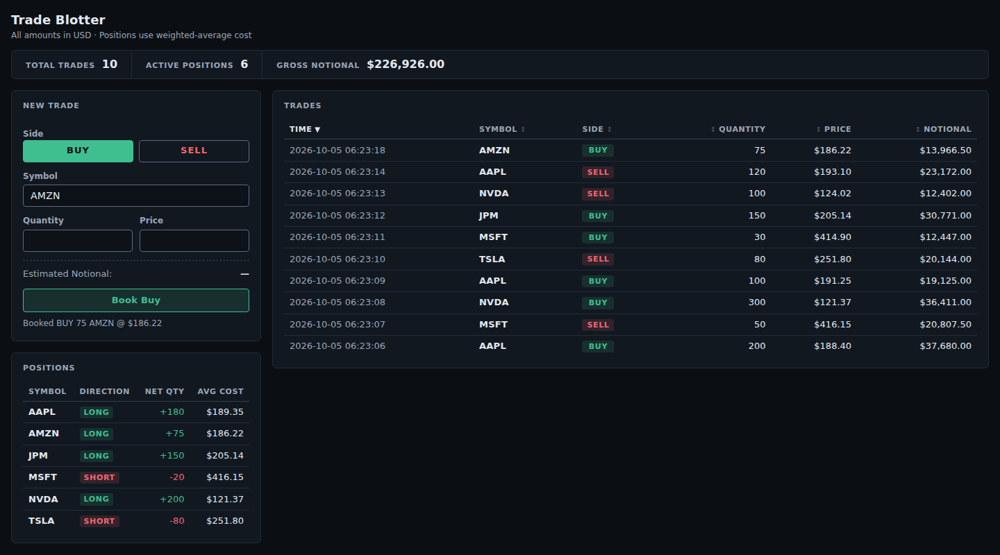

# Trade Blotter

A small trade-capture application. You book equity trades (symbol, buy/sell, quantity, price); the
app keeps an append-only trade history, shows it in a sortable blotter, and derives net positions
with a weighted-average cost from that history.



## Tech Stack

| | |
|---|---|
| **Backend** | C#, .NET 8, ASP.NET Core (controllers), EF Core 8, SQLite |
| **Frontend** | Vue 3 (Composition API, `<script setup>`), TypeScript, Pinia, Vite |
| **Tests** | xUnit (domain unit tests + HTTP integration tests via `WebApplicationFactory`), Vitest |

## Features

- **Trade entry** with client-side validation that mirrors the server's rules; server validation
  messages are mapped back onto the form fields.
- **Blotter** of all trades, newest first by default, with every column sortable. A booked trade
  appears immediately, with no reload, and gets a brief one-time highlight.
- **BUY / SELL** shown as green / red badges that always carry the word, not colour alone.
- **Positions derived from the trade history**: net quantity and weighted-average cost per symbol.
  **LONG / SHORT** is shown as a labelled badge and a signed, coloured quantity.
- **Summary metrics**: total trades, active positions, gross notional.
- **Error handling**: RFC 7807 problem details from the API; a load-error banner with Retry in the
  UI that keeps any data already on screen.

## Project Structure

```
backend/
  TradeBlotter.Api/
    Domain/        Trade, Side, Position, PositionCalculator (no EF/ASP.NET dependencies)
    Data/          EF Core DbContext
    Contracts/     request/response DTOs and their validation attributes
    Controllers/   TradesController, PositionsController
  TradeBlotter.Api.Tests/
    PositionCalculatorTests.cs   accounting rules
    ApiTests.cs                  end-to-end HTTP tests against a throwaway SQLite file
frontend/
  src/
    api.ts, types.ts             fetch client, wire contracts, ApiError
    stores/blotter.ts            Pinia store: trades, positions, request state
    validation.ts, format.ts     pure validation and display formatting
    components/                  TradeForm, TradeBlotter, PositionsPanel, SummaryBar
    __tests__/                   Vitest specs
TradeBlotter.sln
```

The domain lives in a folder rather than its own project: it is four small types, and keeping it
free of EF and ASP.NET references is what keeps it unit-testable.

## Running Locally

**Prerequisites:** a .NET 8 SDK (`global.json` pins the 8.0 band, so a .NET 9-only machine needs
the 8.0 SDK installed alongside), and Node.js 22.18+ or 24.12+ with npm.

**Terminal 1: API** (http://localhost:5080)

```bash
dotnet run --project backend/TradeBlotter.Api
```

On first start the API creates the SQLite database `backend/TradeBlotter.Api/tradeblotter.db`
(via `EnsureCreated`). The file is git-ignored; delete it to start with an empty blotter. Swagger UI
is available at http://localhost:5080/swagger.

**Terminal 2: frontend** (http://localhost:5173)

```bash
cd frontend
npm ci
npm run dev
```

Open http://localhost:5173. In development Vite proxies `/trades` and `/positions` to the API on
port 5080, so the browser talks to a single origin and no CORS configuration is needed.

## Running Tests

```bash
# Backend: domain + API integration tests (from the repository root)
dotnet test

# Frontend (from frontend/)
npm test             # Vitest, single run
npm run type-check   # vue-tsc
npm run build        # type-check + production build
```

## API

All bodies are JSON. `side` is the string `"Buy"` or `"Sell"` (numeric values are rejected).
Errors are [RFC 7807](https://www.rfc-editor.org/rfc/rfc7807) problem details.

| Endpoint | Success | Errors |
|---|---|---|
| `POST /trades` | `201 Created`, `Location: /trades/{id}`, the created trade | `400` validation problem, `415` wrong content type |
| `GET /trades` | `200`, all trades, newest first (`[]` when empty) | |
| `GET /trades/{id}` | `200`, one trade | `404` |
| `GET /positions` | `200`, open positions ordered by symbol; flat positions are omitted | |

**Book a trade.** The server assigns `id` and `timestamp`; the symbol is upper-cased.

```bash
curl -i -X POST http://localhost:5080/trades \
  -H "Content-Type: application/json" \
  -d '{"symbol":"aapl","side":"Buy","quantity":100,"price":187.25}'
```
```
HTTP/1.1 201 Created
Location: http://localhost:5080/trades/1

{"id":1,"symbol":"AAPL","side":"Buy","quantity":100,"price":187.25,"timestamp":"2026-10-05T05:28:38.4381112+00:00"}
```

Validation: `symbol` 1–10 characters (letters, digits, `.`, `-`, starting with a letter);
`quantity` a whole number from 1 to 1,000,000,000; `price` greater than 0 and at most 1,000,000.
Errors are keyed by the JSON field name:

```bash
curl -X POST http://localhost:5080/trades -H "Content-Type: application/json" \
  -d '{"symbol":"AAPL","side":"Buy","quantity":0}'
```
```json
{"title":"One or more validation errors occurred.","status":400,
 "errors":{"price":["Price is required."],
           "quantity":["Quantity must be a whole number between 1 and 1,000,000,000."]}, ...}
```

**Read trades and positions**

```bash
curl http://localhost:5080/trades
curl http://localhost:5080/trades/1
curl http://localhost:5080/positions
```
```json
[{"symbol":"AAPL","quantity":100,"averageCost":187.25}]
```

`quantity` is signed (positive long, negative short). `averageCost` is the average entry price of the
open quantity, rounded to 6 decimal places in the response.

## Position Accounting

Positions are **never stored**. `GET /positions` loads the trade history and replays it through
`PositionCalculator`, a pure function in the domain. The trade table is the single source of truth.

**Method: weighted-average cost.** For each symbol, replay the trades in order and keep a signed net
quantity `Q` and an average cost `A`:

- A trade in the **same direction** as the position (or from flat) blends into the average:
  `A = (|Q|·A + q·p) / (|Q| + q)`.
- A trade in the **opposite direction** reduces the position at the existing average; `A` does
  not change.
- If it reduces the position **exactly to zero**, the position is flat and is omitted.
- If it **crosses zero**, the excess opens a new position on the other side, and **that residual's
  average cost is the execution price of the trade that crossed zero.**

The eight cases, as one continuous AAPL history (this exact sequence is a unit test,
`FullLifecycle_CoversEveryTransitionInOneHistory`):

| Case | Position before | Trade | Position after |
|---|---|---|---|
| Add to long | +100 @ 10 | Buy 50 @ 13 | **+150 @ 11**: (100·10 + 50·13) / 150 |
| Reduce long | +150 @ 11 | Sell 60 @ 15 | **+90 @ 11**: average unchanged |
| Close long | +90 @ 11 | Sell 90 @ 9 | **flat** (omitted) |
| Long → short | +100 @ 20 | Sell 150 @ 22 | **−50 @ 22**: residual at the trade price |
| Add to short | −50 @ 22 | Sell 50 @ 18 | **−100 @ 20**: (50·22 + 50·18) / 100 |
| Reduce short | −100 @ 20 | Buy 40 @ 17 | **−60 @ 20**: average unchanged |
| Close short | −60 @ 20 | Buy 60 @ 21 | **flat** (omitted) |
| Short → long | −30 @ 50 | Buy 50 @ 45 | **+20 @ 45**: residual at the trade price |

**Ordering.** Average cost is path-dependent, so replay order matters. `PositionCalculator` replays
trades in the order it is given; the API supplies them ordered by `Id` (booking order). Ids are
assigned by the database and timestamps by the server at booking time, so booking order and time
order are the same and there is no back-dating.

**Assumptions:** quantities are whole units; selling from flat opens a short (no borrow or locate
checks); a single currency (USD) and a single book; no fees or commissions; symbols are
case-insensitive and stored upper-case. **Gross notional** is the sum of `quantity × price` over all
trades, buys and sells both adding.

## Design Decisions

- **Derived positions, append-only trades.** There is no update or delete endpoint; a mistake is
  corrected by booking an offsetting trade. Because positions are recomputed from that history, there
  is no stored position that can drift from the trades or be lost to a concurrent update.
- **Server-generated ids and timestamps.** The client sends only symbol, side, quantity and price.
  The database identity doubles as the deterministic replay order.
- **`decimal` for prices and costs**, never `double`. The domain keeps full precision; the API
  rounds `averageCost` to 6 decimal places, and the UI displays it with 2 (the full value is in a
  tooltip).
- **SQLite** keeps the exercise zero-setup. Positions are calculated in memory, so SQLite's storage of
  `decimal` as text does not affect the arithmetic.
- **Controllers with DataAnnotations** give `[ApiController]`'s automatic `400` problem details in
  .NET 8 without extra libraries. Controllers use the `DbContext` directly; there is no service,
  repository, CQRS or MediatR layer, which three endpoints don't need.
- **The API is the source of truth for positions.** The frontend never re-implements the accounting;
  after a booking the Pinia store adds the server-created trade to the blotter and re-fetches
  positions.
- **Pinia holds server state** (trades, positions, loading and error state); components keep only
  view state such as form fields and the blotter's sort order. Sorting is a computed copy and never
  reorders the store.
- **Repeated entry:** no side is preselected, so the first trade's direction is a deliberate
  choice. After a booking the side and symbol are kept, quantity and price are cleared, and focus
  returns to quantity.

## Trade-offs / Limitations

- **No P&L.** Realized P&L is implied by the accounting but not reported (flat positions are
  omitted, so their P&L would have nowhere to appear). Unrealized P&L and market value would need a
  market-data source, which this application does not have.
- **No pagination.** `GET /trades` returns everything, and every `GET /positions` replays the full
  history. That is fine at take-home scale; a large book would need paging and incremental position
  snapshots.
- **`EnsureCreated` instead of migrations.** It is simple for a single-table schema, but it cannot
  evolve an existing database.
- **SQLite** is a single local file with limited write concurrency; not a production database.
- **Single user, no authentication.** Other browser sessions see new trades only when they reload.
- **No trade amendments or cancellations**, by design (see append-only above), and no client-supplied
  trade times.

## What I Would Add With More Time

- EF Core migrations in place of `EnsureCreated`.
- Pagination and filtering for a large blotter.
- More integration tests, e.g. `404`/`415` responses and concurrent bookings.
- SignalR push if several users needed to see trades in real time.
- Production concerns: structured logging, health checks, metrics, a server database and
  environment-specific configuration.

## AI Tooling

This project was built with Claude Code, from planning through implementation, tests and this
README. The full session transcript is in
[`docs/claude-code-transcript.md`](docs/claude-code-transcript.md): every prompt, every reply and
every tool call, exported from the Claude Code session log. Long tool outputs are truncated,
screenshots appear as `[image]`, and the model's internal reasoning is omitted.
